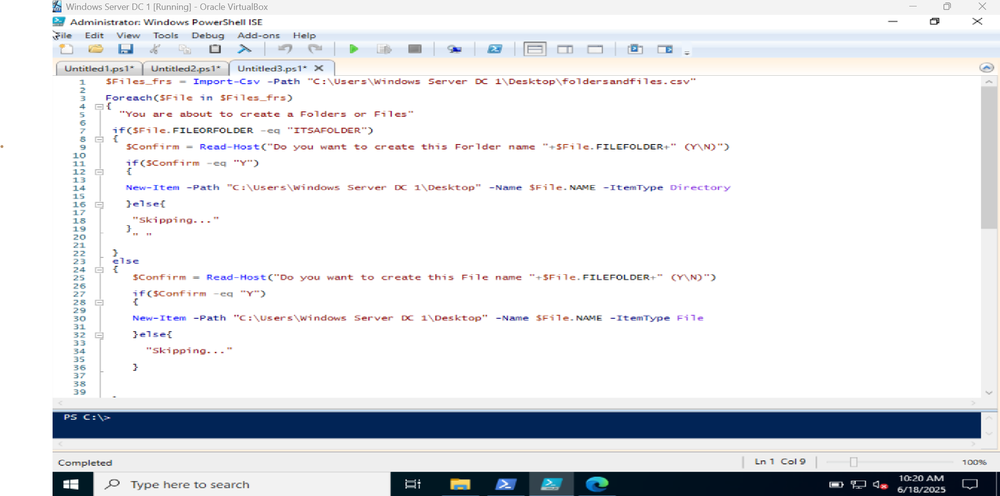

# bulk-folder-creation-powershell
This PowerShell script reads folder names from a .txt file and creates directories based on the entries. It’s a great way to practice file handling, loops, and automation logic — useful for sysadmins and scripting beginners.

# 📂 Bulk Folder Creation Using PowerShell

This PowerShell script reads folder names from a plain `.txt` file and creates folders for each entry in a specified base directory. It's ideal for automating folder structure creation for teams, departments, student directories, or projects.

---

## 🔧 What This Script Does

- Reads a list of folder names from `folder-names.txt`
- Creates a base directory if it doesn't exist
- Loops through each folder name
- Checks if each folder already exists
- Creates the folder if it doesn’t

---

## 📄 Input File: `folder-names.txt`

This file contains the names of the folders to be created. Each line represents a folder.

🖼️ Screenshots
📌 Step	Description	Screenshot

### 🖼️ Screenshots

| Step | Description               | Screenshot |
|------|---------------------------|------------|
| 1️⃣   |  Original Script           |  |
| 2️⃣   | Interactive Script         |  |

